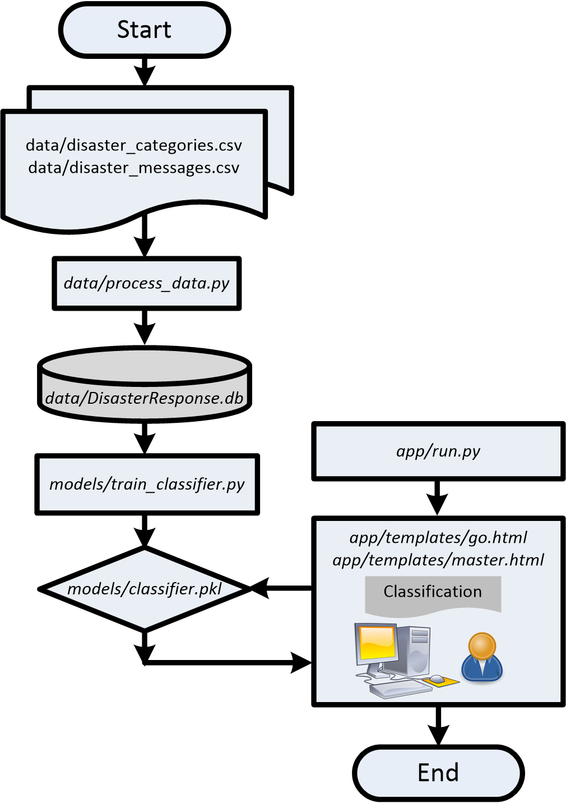

# Disaster Response Pipelines

In this project, a supervised machine-learning is implemented with large labeled database. 

### Table of Contents

1. [Instruction](#instruction)
2. [Project Rationale](#rationale)
3. [File Descriptions](#files)
4. [Results](#results)
5. [Licensing, Authors, and Acknowledgements](#licensing)

## Instruction 

1. Run the following commands in the project's root directory to set up your database and model.

    - To run ETL pipeline that cleans data and stores in database
        `python data/process_data.py data/disaster_messages.csv data/disaster_categories.csv data/DisasterResponse.db`
    - To run ML pipeline that trains classifier and saves
        `python models/train_classifier.py data/DisasterResponse.db models/classifier.pkl`

2. Run the following command in the app's directory to run your web app.
    `cd /home/workspace/app`
    `python run.py`

3. Go to http://0.0.0.0:3001/

## Project Rationale

This dataset contains 30,000 messages drawn from events including an earthquake in Haiti in 2010, an earthquake in Chile in 2010, floods in Pakistan in 2010, super-storm Sandy in the U.S.A. in 2012, and news articles spanning a large number of years and 100s of different disasters. The data has been encoded with 36 different categories related to disaster response and has been stripped of messages with sensitive information in their entirety. 

The main objectives of this project is to learn:

1. How to process the raw message data into the labeled samples suitable for machine learning research?
2. How to train a machine capable of sorting a message into different categories?
3. How to design an interactive webpage that serves as human machine interface (HMI) between the user and the trained machine?

## File Descriptions 

| Preprocessed data | Python Code | Processed data | HTML |
| --- | --- | --- | --- |
| `data/disaster_categories.csv` | `data/process_data.py` | `data/DisasterResponse.db` | `app/templates/go.html` |
| `data/disaster_messages.csv` | `models/train_classifier.py` | `models/classifier.pkl` | `app/templates/master.html` |
| | `app/run.py` | |

## Results

The procedure of this project is briefly presented as follows.

 - `data/process_data.py`synthesizes the information from `data/disaster_messages.csv` and `data/disaster_categories.csv` into `data/DisasterResponse.db`. 
 - `models/train_classifier.py` trains the machine-learning model `models/classifier.pkl` based on the sampled data in the `data/DisasterResponse.db`.
 - `app/run.py` implements the human-machine interface (HMI) `app/templates/go.html` and `app/templates/master.html` in reference to `data/DisasterResponse.db`.
 -  The HMI in the form of HTML interface receives user messages on behalf of the machine-learning model `models/classifier.pkl` and visually outputs the model prediction.

## Licensing, Authors, Acknowledgements

Thanks Hugging Face for collecting the dataset of disaster response message.  You can find the data and other descriptive information at the GitHub link available [here](https://github.com/huggingface/datasets/tree/master/datasets/disaster_response_messages).  Feel free to use the code here.

